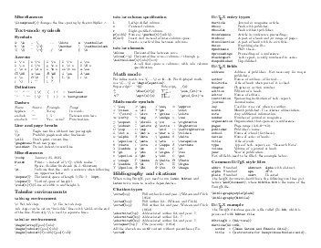

---
---

# Go cheat sheet

This is a Go cheat sheet written in LaTeX which is geared towards printing
double-sided flipped on the short edge so that it can be laminated. Please
send suggestions to stephen@windscale.dev.

It's based on Winston Chang's excellent LaTeX cheatsheet which you can find at
https://github.com/wch/latexsheet.

PNG images of the reference sheet:

### Download

[PDF](go-cheatsheet.pdf) (US letter) |
[PDF](go-cheatsheet-a4.pdf) (A4) |
[LaTeX](go-cheatsheet.tex)

### License

 This work is licensed under a <a rel="license" href="http://creativecommons.org/licenses/by-nc-sa/3.0/">Creative Commons Attribution-NonCommercial-ShareAlike 3.0 Unported License</a>.
